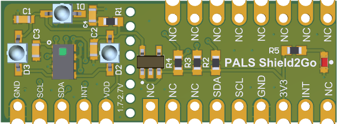

# Proximity-Ambient-Light-Sensor

Library of Infineon's Proximity and Ambient Light **PALS2 Sensor** for Arduino.

## Summary

The PALS-2 ASIC is a proximity and ambient light sensor with integrated photodiodes and multiple LED driver outputs. The device is capable of independently driving three external LEDs via a programmable internal multiplexer. With this capability the user can develop gesture sensing applications with minimum effort. 

The proximity and the ambient light channels are measured with 16bit resolution, allowing good performance also behind a typical plastic or glass cover, without the need for cross-talk reduction measures. 

The device is controlled via a standard I²C interface and can be run with on-demand commands or in self-timed mode. An interrupt output pin with programmable result thresholds (high and low for both proximity (PROX) and ambient light (ALS) results) can be used to wake a microcontroller on a certain event. The device is ideal for use in mobile applications, such as smart phones, tablets, music players etc. when screen locking, backlight dimming and gesture recognition are required.

## Key Features and Benefits

* Integrated photodiodes for minimum package footprint and lowest noise
* Programmable interrupt levels for both ALS and PROX functions
* 300nA power-down current
* 1.8V to 2.7V supply
* I²C interface, 1.7V to 3.6V bus level

### Proximity/HRM Features 
* Three integrated LED driver outputs with 200mA driving capability, with current programmable in 20 steps
* Up to 250 PROX readouts/second, ambient light suppression in PROX/HRM mode up to 100klux
* 16 bit resolution digital output
* Sensitivity up to 300mm distance in PROX mode
* Pulse Oximetry function supported

### Ambient Light Features
* Up to 10 ALS readouts/second
* Artificial 100Hz/120Hz light flicker rejection in ALS mode
* 16 bit resolution
* Programmable gains to provide 10mlx to 82klx measurement range

## Hardware

It depends on the evaluation board which you are using or the respective configuration of the sensor on your PCB (maybe designed by yourself).

Please note that currently no specific evaluation board for Arduino is available by Infineon, but the existing ones can be used together with this library as well as respective wiring.

## Installation

### Integration of Library
Please download this repository from GitHub by clicking on the following field in the latest [release](https://github.com/Infineon/Proximity-Ambient-Light-Sensor/releases) of this repository.

To install the PALS2 sensor library in the Arduino IDE, please go now to **Sketch** > **Include Library** > **Add .ZIP Library...** in the Arduino IDE and navigate to the downloaded .ZIP file of this repository. The library will be installed in your Arduino sketch folder in libraries and you can select as well as include this one to your project under **Sketch** > **Include Library** > **Proximity-Ambient-Light-Sensor**.

## Usage

Please follow the example sketches in the /examples directory in this library to learn more about the usage of the library. Especially, take care of the *Interrupt* and *On Demand*  configuration of the sensor.
